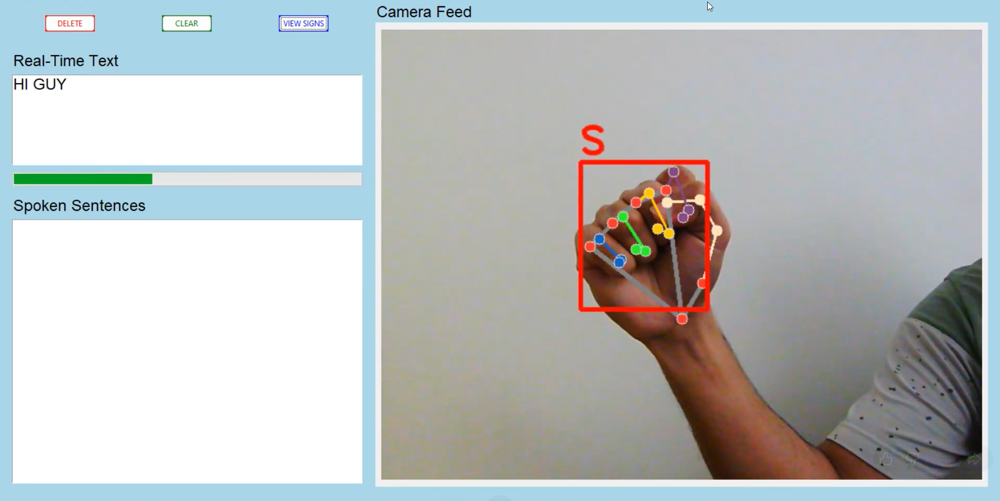
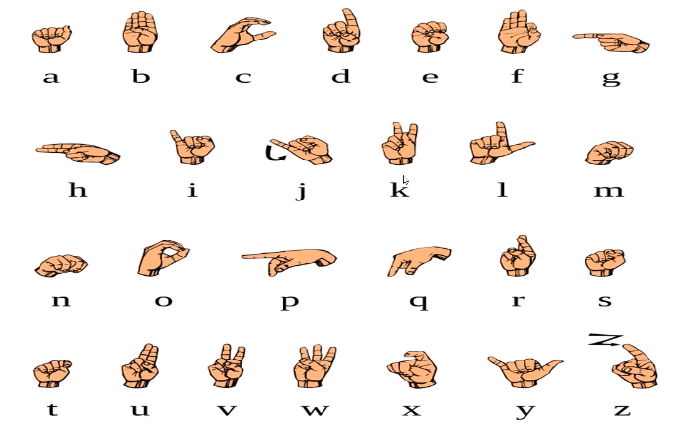

# UNMUTE AI - ASL Sign Language Detection System

A real-time sign language detection application that uses MediaPipe for hand tracking and scikit-learn for machine learning classification. This was a group project for our Fundamentals of smart systems course. The application allows users to communicate using sign language gestures, which are detected in real-time through a webcam and converted to text and speech.

## Features

- **Real-time Sign Language Detection**: Detects sign language gestures from webcam feed
- **Text-to-Speech**: Converts detected signs to spoken words
- **Interactive GUI**: User-friendly Tkinter interface with live camera feed
- **Sentence Building**: Builds sentences from detected signs
- **Sign Reference**: View reference images for sign language gestures

## Application Screenshots

### Application UI



The application provides a user-friendly interface with:
- Live camera feed showing hand detection
- Real-time text output
- Real-time text to speech
- Progress bar indicating detection confidence
- Sentence history display
- Control buttons for text manipulation

### ASL Sign Reference



The `signs.png` file contains a reference guide showing all ASL alphabet signs. You can view this reference in the application by clicking the "VIEW SIGNS" button.

## Requirements

### Python Version

**IMPORTANT**: This application requires **Python 3.11** specifically. MediaPipe currently does not support Python versions newer than 3.11.

### System Requirements

- Python 3.11
- Webcam/camera for real-time detection
- Windows, macOS, or Linux

## Installation

### 1. Clone the Repository

```bash
git clone <repository-url>
cd Unmute_AI-ASL_sign_language_detection_system
```

### 2. Create Virtual Environment

**For Windows:**
```bash
py -3.11 -m venv venv
```

**For macOS/Linux:**
```bash
python3.11 -m venv venv
```

### 3. Activate Virtual Environment

**Windows:**
```bash
venv\Scripts\activate
```

**macOS/Linux:**
```bash
source venv/bin/activate
```

### 4. Install Dependencies

```bash
pip install -r requirements.txt
```

### 5. Download and Setup Dataset

**IMPORTANT**: Before running `create_dataset.py`, you need to download and set up the ASL alphabet dataset.

1. Download the dataset from Kaggle: [ASL Alphabet Dataset](https://www.kaggle.com/datasets/grassknoted/asl-alphabet?select=asl_alphabet_train)

2. Extract the downloaded dataset

3. Copy all folders from the `asl_alphabet_train` folder to the `image_dataset/` folder in this project

   The `image_dataset/` folder should contain folders for each sign (A, B, C, ..., Z, space, del, nothing, etc.)

**Note**: The dataset contains training images for each ASL sign. Each folder should contain multiple images of the same sign gesture.

## Project Structure

```
Unmute_AI-ASML_sign_language_detection_system/
├── unmute_ai/              # Main package
│   ├── __init__.py
│   ├── config.py          # Configuration and constants
│   ├── hand_detector.py   # MediaPipe hand detection
│   ├── data_processor.py  # Dataset creation from images
│   ├── trainer.py         # Model training
│   └── gui.py             # Tkinter GUI application
├── image_dataset/         # Sign language images (one folder per sign)
│   ├── A/
│   ├── B/
│   ├── ...
│   ├── space/
│   └── del/
├── output/                # Generated files (created automatically)
│   ├── data.pickle        # Processed dataset
│   └── model.p            # Trained model
├── create_dataset.py      # Entry point: Create dataset
├── train.py               # Entry point: Train model
├── app.py                 # Entry point: Run application
├── signs.png             # Reference image showing all ASL symbols
├── demo.png              # Screenshot of the application UI
├── requirements.txt       # Python dependencies
└── README.md             # This file
```

## Usage

The application follows a three-step process:

### Step 0: Setup Dataset (Required First Step)

**Before running `create_dataset.py`, ensure you have completed the dataset setup:**

1. Download the ASL Alphabet dataset from [Kaggle](https://www.kaggle.com/datasets/grassknoted/asl-alphabet?select=asl_alphabet_train)
2. Extract the dataset and locate the `asl_alphabet_train` folder
3. Copy **all folders** from `asl_alphabet_train` into the `image_dataset/` folder in this project

**Expected folder structure after setup:**
```
image_dataset/
├── A/
│   ├── image1.jpg
│   ├── image2.jpg
│   └── ... (multiple images)
├── B/
│   ├── image1.jpg
│   └── ... (multiple images)
├── C/
├── ...
├── Z/
├── space/
├── del/
└── nothing/
```

### Step 1: Create Dataset

Once the dataset is set up, process sign language images and extract hand landmarks using MediaPipe:

```bash
python create_dataset.py
```

This script:
- Reads images from the `image_dataset/` folder
- Each subfolder should contain images of a specific sign (A, B, C, ..., space, del, etc.)
- Extracts hand landmarks using MediaPipe
- Saves the processed data to `output/data.pickle`

### Step 2: Train Model

Train a RandomForest classifier on the processed dataset:

```bash
python train.py
```

This script:
- Loads the dataset from `output/data.pickle`
- Splits data into training and test sets
- Trains a RandomForest classifier
- Displays model accuracy
- Saves the trained model to `output/model.p`

### Step 3: Run Application

Launch the GUI application for real-time sign language detection:

```bash
python app.py
```

The application will:
- Open your webcam
- Detect sign language gestures in real-time
- Display detected characters
- Build sentences from detected signs
- Convert text to speech
- Provide controls for deleting characters, clearing text, and viewing sign references

## Application Controls

- **DELETE**: Remove the last character from the current sentence
- **CLEAR**: Clear the entire current sentence
- **VIEW SIGNS**: Open a reference window showing sign language gestures (displays `signs.png`)

## Sign Gestures

The application recognizes:
- **Letters**: A through Z (26 letters)
- **Space**: Gesture for space character
- **Delete/Enter**: Gesture to speak the current sentence and clear it
- **Nothing**: No hand detected (used for training data)

Refer to `signs.png` for visual reference of all supported signs.

## Configuration

You can modify settings in `unmute_ai/config.py`:

- `DETECTION_TIMER_THRESHOLD`: Number of frames to hold a sign before adding it (default: 30)
- `MEDIAPIPE_MIN_DETECTION_CONFIDENCE`: Minimum confidence for hand detection (default: 0.3)
- `TEST_SIZE`: Proportion of data for testing (default: 0.2)

### Project Architecture

The project is organized into modular components:

- **`unmute_ai/config.py`**: Centralized configuration
- **`unmute_ai/hand_detector.py`**: Hand detection and landmark extraction
- **`unmute_ai/data_processor.py`**: Image processing and dataset creation
- **`unmute_ai/trainer.py`**: Model training logic
- **`unmute_ai/gui.py`**: User interface and application logic

### Adding New Signs

1. Create a new folder in `image_dataset/` with the sign name
2. Add multiple images of the sign gesture (the more images, the better the model performance)
3. Run `create_dataset.py` to process the new images
4. Run `train.py` to retrain the model with the new sign

**Note**: For best results, include at least 50-100 images per sign gesture in your training data.

## Dependencies

- `scikit-learn`: Machine learning model
- `numpy`: Numerical operations
- `mediapipe`: Hand detection and landmark extraction
- `opencv-python`: Image and video processing
- `gTTS`: Text-to-speech conversion
- `pygame`: Audio playback
- `Pillow`: Image processing for GUI

